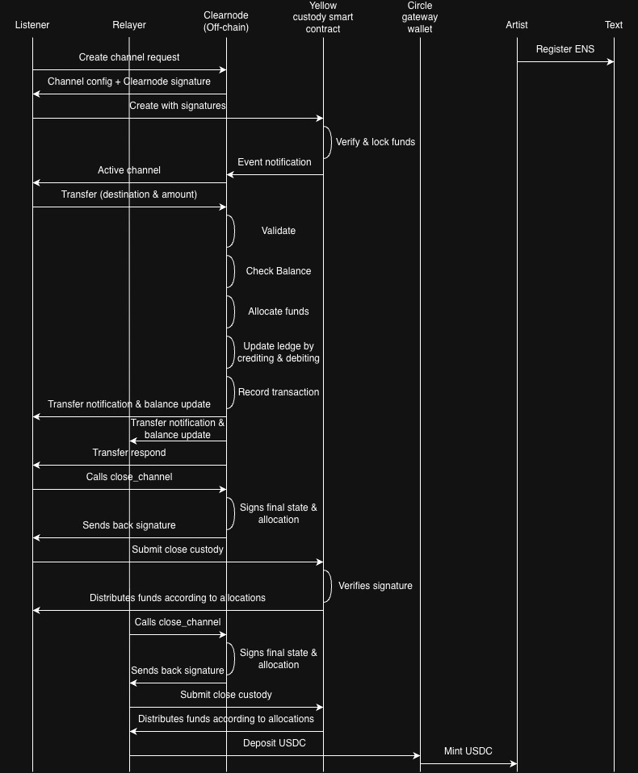

# LeStream - Decentralized Music Streaming with Instant Micropayments

> **A Music Streaming Platform Powered by Yellow Network, Circle Gateway, and ENS**

## Overview

LeStream is a decentralized music streaming platform that enables **real-time, per-second micropayments** to artists using state channel technology.

### The Problem

1. **Delayed Payments**: Artists wait 30-90 days for royalties
2. **High Transaction Fees**: On-chain payments per stream cost more than the stream itself
3. **No Blockchain Choice**: Artists locked into platform's chain
4. **Complex Royalty Splits**: Collaborators struggle to receive fair shares

### Our Solution

| Technology | Purpose |
|------------|---------|
| **Yellow Network (Nitrolite)** | Off-chain state channels for instant, gasless micropayments |
| **Circle Gateway** | Cross-chain USDC transfers to artist's preferred blockchain |
| **ENS** | Human-readable identities with stored blockchain preferences |

---

## Architecture

The following diagram illustrates the complete flow from listener to artist payment:



**Flow Summary:**
1. **Artist Registration**: Artist registers ENS name with payout chain preference stored in text records
2. **Channel Creation**: Listener creates a state channel with the Relayer, funds are locked in Yellow custody smart contract
3. **Off-Chain Streaming**: Transfers and balance updates happen off-chain via Clearnode
4. **Session Close**: When listener ends session, final state is signed and funds are distributed
5. **Cross-Chain Payout**: Circle Gateway mints USDC on artist's preferred blockchain

---

## Key Features

### Screenshots

| Song Library | Upload Song | Music Player |
|:---:|:---:|:---:|
|  |  |  |
| Browse tracks with per-second pricing | Artists upload music and set royalty preferences | Stream music with real-time micropayments |

---

### For Listeners
- **Gasless Streaming**: No transaction fees while listening
- **Pay-Per-Second**: Only pay for what you actually listen to
- **Session-Based Payments**: Sign ONE on-chain transaction when you stop listening
- **Web2-Like Experience**: Feels exactly like Spotify, but decentralized

### For Artists
- **Instant Revenue**: Receive payments when listeners finish their session
- **Choose Your Blockchain**: Select preferred chain (Arc, Ethereum, Base, Avalanche)
- **Custom Royalty Splits**: Define percentage-based splits for collaborators
- **ENS Integration**: Store payout preferences in your ENS profile

---

## How It Works

### Phase 1: Session Start (One On-Chain Transaction)
1. Connect your Web3 wallet
2. Deposit USDC into Yellow Network state channel
3. Relayer returns channel config with Clearnode signature
4. Yellow custody smart contract verifies and locks funds
5. Session activated - start listening immediately

### Phase 2: Active Listening (All Off-Chain)
While streaming, micropayments happen entirely off-chain:

1. **Play a Song**: Select and start playing
2. **Per-Second Billing**: Balance decreases based on track's price-per-second
3. **Switch Songs**: Each switch triggers off-chain transfer to Clearnode
4. **Ledger Updates**: Clearnode validates, checks balance, allocates funds, and updates ledger
5. **Balance Sync**: Both listener and relayer receive balance update notifications

**Key Innovation**: When a listener stops listening to one song to listen to another, they submit an **off-chain microtransaction**. This records how long they listened and calculates the payment owed. The listener only signs an on-chain transaction **once** - when they completely stop listening.

### Phase 3: Session End (Final On-Chain Settlement)
1. User calls `close_channel` - sends request to Relayer
2. Relayer signs final state and allocation
3. Signature submitted to Yellow custody smart contract
4. Contract verifies signature and distributes funds according to allocations
5. Artist's share deposited to Circle Gateway
6. Circle Gateway mints USDC on artist's preferred blockchain (read from ENS)
7. Remaining balance returned to listener

---

## Yellow Network Integration

### Why Yellow Network for Music Streaming?

| Approach | Transactions | Cost per 1-hour session |
|----------|--------------|-------------------------|
| On-chain per second | 3,600 txns | ~$360 - $3,600 in gas |
| On-chain per song | ~15 txns | ~$15 - $150 in gas |
| **Yellow Network** | **2 txns** | **< $1 in gas** |

Yellow Network makes micropayments viable by:
1. **Collapsing transactions**: Thousands of state updates become one settlement
2. **Eliminating gas**: Off-chain operations cost nothing
3. **Maintaining security**: Smart contracts guarantee funds are protected

### Implementation

#### Session Management
```typescript
interface UserSession {
  sessionId: string;
  channelId: string;
  depositAmount: bigint;
  currentBalance: bigint;
  totalSpent: bigint;
  listeningHistory: PlayEvent[];
}
```

#### Backend Architecture
```
┌─────────────┐     ┌─────────────┐     ┌─────────────────────────┐
│  Frontend   │────▶│  Backend    │────▶│  Yellow Network         │
│  Next.js    │     │  Express    │     │  (Nitrolite/Clearnode)  │
└─────────────┘     └─────────────┘     └─────────────────────────┘
```

#### API Endpoints
| Endpoint | Method | Description |
|----------|--------|-------------|
| `/session/start` | POST | Create new streaming session |
| `/session/balance` | GET | Query current session balance |
| `/session/play` | POST | Start playing a track |
| `/session/stop` | POST | Stop playing, record micropayment |
| `/session/end` | POST | End session, settle on-chain |

#### Microtransaction Model
```typescript
interface PlayEvent {
  songId: string;
  durationSeconds: number;
  pricePerSecond: bigint;
  totalCost: bigint;  // durationSeconds * pricePerSecond
}
```

---

## Circle Gateway Integration

### What is Circle Gateway?

Circle Gateway enables **unified USDC balances** across multiple blockchains. Deposit on one chain, withdraw on any supported chain without bridging delays.

Key capabilities:
- **Chain Abstraction**: Multiple chains as a single liquidity surface
- **Instant Transfers**: Move USDC between chains in seconds
- **No Bridging Risk**: Native USDC minting via attestation
- **Unified Balance**: One deposit available across all chains

### Why Circle Gateway for Artist Payouts?

Artists prefer different chains:
- **Ethereum**: Established DeFi ecosystem
- **Base**: Low fees, Coinbase integration
- **Arc**: Circle's native L1
- **Avalanche**: High throughput

Circle Gateway enables LeStream to collect payments on Arc and route to each artist's preferred blockchain with native USDC.

### Supported Chains

| Chain | Domain ID | USDC Address |
|-------|-----------|--------------|
| Arc Testnet | 26 | `0x3600000000000000000000000000000000000000` |
| Ethereum Sepolia | 0 | `0x1c7D4B196Cb0C7B01d743Fbc6116a902379C7238` |
| Base Sepolia | 6 | `0x036CbD53842c5426634e7929541eC2318f3dCF7e` |
| Avalanche Fuji | 1 | `0x5425890298aed601595a70AB815c96711a31Bc65` |

### Gateway Contracts
```typescript
const GATEWAY_WALLET: Address = "0x0077777d7EBA4688BDeF3E311b846F25870A19B9";
const GATEWAY_MINTER: Address = "0x0022222ABE238Cc2C7Bb1f21003F0a260052475B";
```

### Transfer Flow

1. Session ends on Arc, royalties calculated
2. Query artist's preferred chain (from ENS)
3. Create burn intent with EIP-712 signature
4. Submit to Gateway API for attestation
5. Call `gatewayMint()` on destination chain
6. USDC minted directly to artist's wallet

```typescript
interface TransferSpec {
  sourceDomain: number;
  destinationDomain: number;
  sourceToken: Hex;
  destinationToken: Hex;
  destinationRecipient: Hex;
  value: bigint;
}
```

---

## ENS Integration

### Why ENS for Music Streaming?

ENS provides human-readable names and stores arbitrary data via text records. LeStream uses this for **decentralized artist profiles**.

### Our Implementation

#### 1. Human-Readable Artist Identities
Display `artist.eth` instead of `0x14EBE0528f...`. Makes royalty splits and payment confirmations more understandable.

#### 2. Stored Blockchain Preferences
**Custom text records** store artist preferences:

```
ENS Text Records for artist.eth:
├── lestream.payout-chain: "Base_Sepolia"
└── lestream.royalty-split: "70"
```

Artists can specify:
- **Preferred Blockchain**: Which chain for payouts
- **Royalty Percentage**: Their share for collaborations

### ENS Resolution
```typescript
export async function resolveENSName(name: string): Promise<string | null>;
export async function getENSText(name: string, key: string): Promise<string | null>;

// Get payout chain from ENS
export function usePayoutChainPreference(ensName: string | undefined) {
  return useENSText(ensName, "lestream.payout-chain");
}
```

### ENS + Gateway Integration

When a session ends:
1. Resolve ENS names to addresses
2. Query payout chain from ENS text records
3. Execute Circle Gateway transfers to each artist's preferred chain

---

## Artist Features

### Configuring Payout Settings

Artists control how they receive royalties:

#### Select Preferred Blockchain
Choose from Circle Gateway supported chains:
- **Arc**: Circle's native L1
- **Ethereum**: Most established
- **Base**: Low fees, Coinbase ecosystem
- **Avalanche**: High throughput

#### Set Royalty Percentage
For collaborative works:
```
Song: "Epic Collaboration"
├── Primary Artist (producer.eth): 50%
├── Featured Artist (vocalist.eth): 30%
└── Songwriter (writer.eth): 20%
```

Each collaborator receives their percentage in native USDC on their preferred chain.

---

## Technical Architecture

### Frontend (Next.js 16)
```
/app
├── page.tsx              # Landing page
├── listen/               # Music player
├── artist/               # Artist dashboard
├── upload/               # Upload tracks
└── api/
    ├── yellow-session/   # Yellow backend proxy
    ├── gateway/          # Circle Gateway endpoints
    └── ens/              # ENS resolution
```

### Backend (Express.js)
```
/yellow
├── server.js             # Express entry
├── src/
│   ├── services/         # Yellow Network
│   └── session/          # Session management
```

### Key Dependencies
- **Next.js 16**: React framework
- **Tailwind CSS**: Styling
- **Wagmi/Viem**: Ethereum interactions
- **Framer Motion**: Animations

---

## Installation

### Prerequisites
- Node.js 20+
- Web3 wallet (MetaMask)
- USDC on supported testnet

### Setup

```bash
# Clone repository
git clone https://github.com/choonxiangg/hack-money-2026.git
cd hack-money-2026

# Install dependencies
npm install
cd yellow && npm install && cd ..
cd arc && npm install && cd ..
```

### Environment Configuration

`.env.local`:
```bash
NEXT_PUBLIC_YELLOW_BACKEND_URL=http://localhost:3001
EVM_PRIVATE_KEY=0x...
```

`yellow/.env`:
```bash
PRIVATE_KEY=0x...
RELAYER_PRIVATE_KEY=0x...
SEPOLIA_RPC_URL=https://eth-sepolia.g.alchemy.com/v2/...
CLEARNODE_WS_URL=wss://clearnet-sandbox.yellow.com/ws
YELLOW_SERVER_PORT=3001
```

### Running Locally

**Terminal 1 - Yellow Backend:**
```bash
cd yellow
npm run server:dev
```

**Terminal 2 - Frontend:**
```bash
npm run dev
```

Open http://localhost:3000

---

## Testing

### Yellow Network
```bash
cd yellow
npm run test:app-session
```

### Circle Gateway
```bash
cd arc
npm run test:gateway
```

### Manual API Testing
```bash
# Health check
curl http://localhost:3001/health

# Start session
curl -X POST http://localhost:3001/session/start \
  -H "Content-Type: application/json" \
  -d '{"userAddress": "0x...", "privateKey": "0x...", "depositAmount": "0.01"}'

# Check balance
curl "http://localhost:3001/session/balance?address=0x..."

# End session
curl -X POST http://localhost:3001/session/end \
  -H "Content-Type: application/json" \
  -d '{"userAddress": "0x..."}'
```

---

## Deployment

### Live Demo
**https://hack-money-2026-git-yz-frontend-choonxianggs-projects.vercel.app**

### Deploy Frontend (Vercel)
```bash
npm i -g vercel
vercel
```

### Deploy Yellow Backend
Host on Railway, Render, or DigitalOcean with WebSocket support.

---

## ETHGlobal HackMoney 2026 Prize Tracks

### Yellow Network Prize
- Session-based transactions with deposited funds
- Off-chain micropayments for each song
- On-chain settlement when session ends
- Real-time Web2-like UX

### Circle Arc Prize
- Chain abstraction via Circle Gateway
- Cross-chain routing to artist's preferred chain
- Unified user experience
- Native USDC minting via attestation

### ENS Prize
- ENS name resolution for artist identities
- Custom text records for payout chain preferences
- Decentralized artist profiles
- ENS preferences drive cross-chain payment routing

---

## Resources

### Yellow Network
- [Documentation](https://docs.yellow.org/docs/learn)
- [Tutorials](https://www.youtube.com/playlist?list=PL5Uk-e9pgXVldFAweILUcZjvaceTlgkKa)

### Circle
- [Gateway Documentation](https://developers.circle.com/gateway)
- [Supported Blockchains](https://developers.circle.com/gateway/references/supported-blockchains)

### ENS
- [Documentation](https://docs.ens.domains)
- [Text Records](https://docs.ens.domains/web/records)

---

## License

MIT License

---

<p align="center">
  <strong>LeStream</strong> - The Future of Music Streaming is Decentralized
</p>

<p align="center">
  <a href="https://hack-money-2026-git-yz-frontend-choonxianggs-projects.vercel.app">Try Live Demo</a>
  ·
  <a href="https://github.com/choonxiangg/hack-money-2026">View Source</a>
</p>
